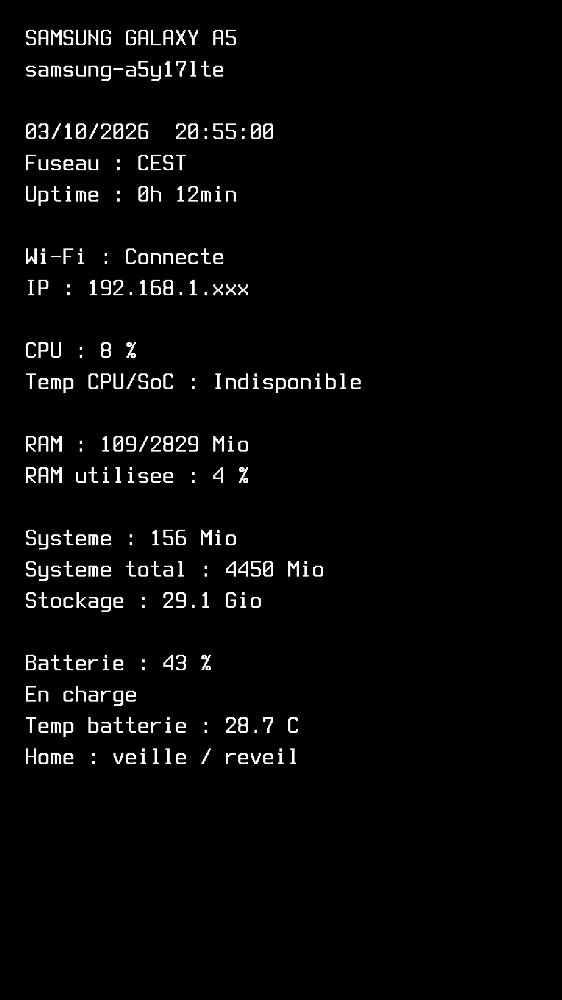
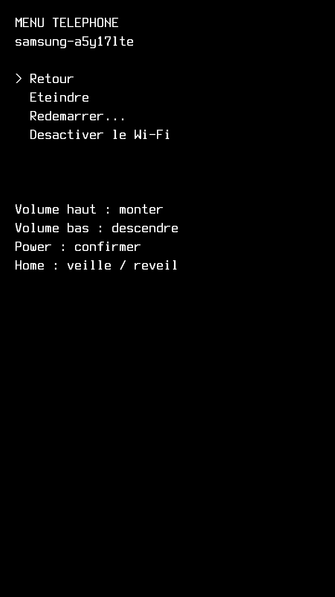

# Linux serveur — Samsung Galaxy A5 (2017)

Distribution prête à installer sur **Samsung Galaxy A5 2017 `a5y17lte` / Exynos 7880**, basée sur Nura / postmarketOS / Alpine Linux, avec OpenRC et noyau downstream 3.18.140-r3. Elle transforme ce téléphone en petit serveur Linux accessible par SSH, avec un tableau local.

Il s'agit d'un port archivé. La configuration d'origine et ses correctifs ont été essayés sur un A5 ; **le ZIP de distribution assaini a été vérifié sur PC, mais n'a pas encore été réinstallé sur le téléphone**. Il ne cible ni l'A40, ni les autres générations d'A5.

## Fichiers prêts à l'emploi

- [Télécharger la ROM construite](https://github.com/evergreen-stack/linux-serveur-samsung-a5-2017/releases/download/v1.0.0/linux-serveur-samsung-a5-2017-v1.zip) (`release/linux-serveur-samsung-a5-2017-v1.zip`) : **ROM recovery à installer**, déjà construite, sans profil Wi-Fi ni mot de passe personnel.
- [Télécharger TWRP 3.7.0_9-0-a5y17lte depuis Team Win](https://dl.twrp.me/a5y17lte/twrp-3.7.0_9-0-a5y17lte.img.html) : même version que le recovery utilisé. Placer le fichier dans `release/` après téléchargement. L’image n’est pas réhébergée sur ce dépôt.
- `apk-wifi/` : outils NetworkManager/wpa_supplicant et toutes leurs dépendances récupérables, avec SHA256. Ces outils sont également **déjà installés dans la ROM** ; les APK se trouvent aussi dans `/opt/linux-serveur-samsung-a5-2017/apk-wifi/` sur le téléphone.
- `docs/INSTALLATION.md` : installation, choix du mot de passe, SSH USB, connexion Internet puis SSH Wi-Fi.
- `release/verification.json`, `release/CONTENU-ZIP.txt` et `SHA256SUMS` : contrôles du contenu et de l'intégrité.

Le [paquet complet v1](https://github.com/evergreen-stack/linux-serveur-samsung-a5-2017/releases/download/v1.0.0/linux-serveur-samsung-a5-2017-v1-complet.zip), est une **archive de partage pour le PC** contenant la ROM, les APK, les guides, les images et les sources ; TWRP se télécharge séparément sur le site officiel. Il faut l'extraire et installer le ZIP ROM situé dans `release/`, pas installer directement le paquet complet dans TWRP.

## Ajouts intégrés

- Tableau blanc sur fond noir, police 24 × 48 pixels : nom d'hôte, IPv4 avec dernier octet `xxx`, heure, durée de fonctionnement, CPU, RAM, stockage et batterie. Capteurs absents signalés honnêtement.
- Actualisation toutes les deux secondes ; extinction de l'écran après cinq minutes sans utilisation des boutons. Le système et SSH restent actifs.
- Bouton Home : veille/réveil de l'écran.
- Power : ouvre le menu et confirme. Volume haut/bas : navigation. « Retour » est sélectionné à l'ouverture.
- Menu : retour, extinction, redémarrage, activation/désactivation du Wi-Fi. Sous-menu : redémarrage normal, recovery/TWRP, download, console de secours.
- Module `evdev` et chargement automatique, framebuffer console, correctif initramfs `--direct-io=off` et console de démarrage.
- NetworkManager + wpa_supplicant D-Bus, SSH, français `fr_FR.UTF-8`, fuseau `Europe/Paris`, synchronisation chrony.
- Compte `user` verrouillé à la distribution, root verrouillé, aucun mot de passe commun. Chaque destinataire choisit son mot de passe dans TWRP avant le premier démarrage.
- Suppression des profils et secrets Wi-Fi, clés SSH personnelles et clés hôte, historiques, journaux, sauvegardes, identifiants de machine et données de synchronisation.

Le Wi-Fi 2,4 GHz WPA2 a fonctionné sur l'installation de départ. SAE/WPA3 n'était pas annoncé par la pile Wi-Fi de ce port ; ce paquet n'ajoute pas sa prise en charge. Le 5 GHz reste à vérifier selon le point d'accès et son mode de sécurité.

## Aperçus de l'interface

Ces images sont **des rendus du programme avec des données d'exemple**, pas des captures du téléphone. Aucun nom de box, BSSID ou IP personnelle n'y apparaît.

| Tableau de bord | Menu Power |
| --- | --- |
|  |  |

## Sources et reconstruction

Les scripts et correctifs sont dans `src/` et `scripts/`. Les APKBUILD du port sont issus de pmaports `bbcd4e5b5f1d6feb37d22f240e70a0d9d9416315`, avec les correctifs locaux documentés dans `docs/RECONSTRUCTION.md`.

Le dépôt GitHub contient les sources, guides et aperçus. Les gros binaires de `release/` et `apk-wifi/` sont exclus de l’historique Git et fournis dans la [release v1.0.0](https://github.com/evergreen-stack/linux-serveur-samsung-a5-2017/releases/tag/v1.0.0).

Les composants tiers conservent leurs licences : noyau GPL-2.0, recovery installer GPL-3.0-or-later, port et firmware selon leurs métadonnées, TWRP selon ses licences propres. Voir `LICENCES.md`.

## Correctif du délai de démarrage Wi-Fi

Un [correctif séparé et réversible](docs/CORRECTIF-DEMARRAGE-WIFI.md) réduit de 60 à 5 secondes l’attente de secours des firmwares absents. Voir [le script](scripts/corriger-attente-wifi-a5.sh) pour l’installation sur le téléphone. Le gain au prochain démarrage reste à mesurer. Les ZIP v1.0.0 publiés ne sont pas reconstruits.
